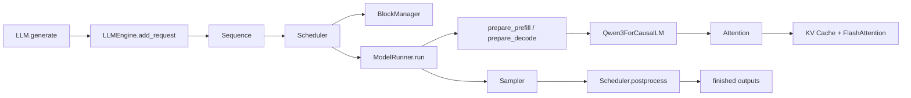

# Nano-vLLM 架构导读

本文面向希望阅读源码、定位性能瓶颈或继续扩展 `nanovllm` 的开发者，重点解释以下问题：

- 这个项目的整体分层是什么。
- 一次 `generate()` 调用会经历哪些关键阶段。
- 调度器怎样在 `prefill` 和 `decode` 之间切换。
- `paged attention`、`prefix cache` 和 KV cache 是如何协同工作的。
- 张量并行、权重加载、CUDA Graph 等优化是在哪里接入的。

文中提到的源码路径都可以直接在仓库中打开对照阅读。

## 1. 项目定位

`nano-vllm` 不是一个“功能最全”的推理框架，而是一个“尽量短小但保留关键思想”的 vLLM 风格实现。

它的目标很明确：

- 保留离线批量推理最核心的机制：continuous batching、paged KV cache、prefix cache、tensor parallel、CUDA Graph。
- 把实现压缩到一个足够小、可以完整读完的 Python 代码库里。
- 让你能快速看清高性能推理引擎的骨架，而不是先陷入大量工程细节。

因此，它更像一份“可运行的教学实现”。

## 2. 目录地图

| 模块 | 关键文件 | 作用 |
| --- | --- | --- |
| 用户入口 | `nanovllm/llm.py` | 暴露 `LLM` 类，接口尽量贴近 vLLM |
| 引擎主控 | `nanovllm/engine/llm_engine.py` | 请求入队、调度、执行、返回结果 |
| 调度层 | `nanovllm/engine/scheduler.py` | 管理 `waiting/running` 队列，决定本轮做 prefill 还是 decode |
| KV cache 管理 | `nanovllm/engine/block_manager.py` | 管理物理 block、前缀缓存、引用计数、分配与回收 |
| 请求对象 | `nanovllm/engine/sequence.py` | 保存一条序列的 token、状态、block table、采样参数 |
| 执行器 | `nanovllm/engine/model_runner.py` | 初始化分布式、加载模型、准备输入、执行模型、采样 |
| 模型定义 | `nanovllm/models/qwen3.py` | 当前仅实现 `Qwen3ForCausalLM` |
| 注意力实现 | `nanovllm/layers/attention.py` | 写入 KV cache，并调用 FlashAttention |
| 并行线性层 | `nanovllm/layers/linear.py` | Column/Row parallel 线性层和 QKV 打包加载 |
| Embedding/LM Head | `nanovllm/layers/embed_head.py` | 词表并行 embedding 和输出头 |
| 运行时上下文 | `nanovllm/utils/context.py` | 用一个全局 `Context` 在层间共享调度元数据 |
| 权重加载 | `nanovllm/utils/loader.py` | 读取 safetensors，并把 Hugging Face 权重映射到本地模块 |

## 3. 整体执行流

从高层看，一次推理可以概括为下面这条链路：



如果把多卡也考虑进来，则 `rank 0` 还是主控，其他 `rank` 更像“被远程调用的执行 worker”：

- `LLMEngine` 会先在主进程里创建 `rank 0` 的 `ModelRunner`。
- 当 `tensor_parallel_size > 1` 时，还会额外 `spawn` 出其他进程，每个进程运行一个 `ModelRunner(rank=i)`。
- `rank 0` 通过共享内存和 `Event` 把方法调用广播给其他 rank。
- 只有 `rank 0` 负责采样并把 token 返回给调度器。

这套结构简单但很实用，因为它把“多卡执行”和“主控调度”分开了。

## 4. 从 `generate()` 到结果返回

### 4.1 初始化阶段

`LLMEngine.__init__` 会做几件事：

1. 根据传入参数构造 `Config`。
2. 按 `tensor_parallel_size` 启动额外的 worker 进程。
3. 创建 `ModelRunner(rank=0)`。
4. 加载 tokenizer，并把 `eos_token_id` 写回 `config.eos`。
5. 创建 `Scheduler`。

`Config` 的职责很轻，主要做配置归一化：

- 读取 Hugging Face 配置。
- 把 `max_model_len` 截断到模型支持的上限。
- 保存 `max_num_batched_tokens`、`max_num_seqs`、`gpu_memory_utilization` 等运行时参数。

### 4.1.1 `Config` 参数逐项解释

如果你是第一次读这个项目，`Config` 里最值得先理解的是下面这些字段。它们基本决定了这个引擎“能同时处理多少请求”“能占多少显存”“是否启用某些优化”。

| 参数 | 类型 / 默认值 | 作用 | 对运行时的实际影响 |
| --- | --- | --- | --- |
| `model` | `str` | 模型目录路径 | 应该指向本地模型目录，里面至少要有 Hugging Face 配置和 safetensors 权重 |
| `max_num_batched_tokens` | `16384` | 单轮 prefill 允许处理的 token 总数上限 | 越大，prefill 吞吐通常越高，但显存压力也越大；调度器会用它限制一轮能吸收多少 prompt token |
| `max_num_seqs` | `512` | 单轮调度最多处理多少条序列 | 同时限制 prefill batch 和 decode batch 的“条数”上限 |
| `max_model_len` | `4096` | 引擎侧允许的最大序列长度 | 最终会被截断到模型的 `max_position_embeddings`；它会影响 warmup 长度、CUDA Graph 页表大小，以及可用 KV cache 的估算 |
| `gpu_memory_utilization` | `0.9` | 允许拿出多少比例的总显存给运行时使用 | 主要用于估算 KV cache block 数；值越大，可分给 cache 的显存越多，但安全余量越小 |
| `tensor_parallel_size` | `1` | 张量并行的 rank 数 | 大于 1 时会启动额外进程，并对线性层、embedding、LM head 做分片 |
| `enforce_eager` | `False` | 是否强制关闭 CUDA Graph，始终走 eager 执行 | 打开后更容易调试，但通常 decode 性能会下降 |
| `kvcache_block_size` | `256` | 每个 KV cache block 容纳多少 token | 决定页大小、block table 长度和 prefix cache 粒度；当前实现最好视为固定 `256` |
| `num_kvcache_blocks` | `-1` | 最终可用的物理 block 数 | 这是运行时根据显存动态算出来的，不是主要给用户手动配置的参数 |
| `eos` | `-1` | 结束 token id | 初始化后会被 tokenizer 的 `eos_token_id` 回填，用来判断何时停止生成 |
| `hf_config` | `None` | Hugging Face 原始模型配置对象 | 运行时会从模型目录加载，用来读取层数、hidden size、头数、最大位置等模型结构参数 |

可以把这些参数分成三类来记：

- 控制 batch 规模的：`max_num_batched_tokens`、`max_num_seqs`
- 控制显存与缓存的：`gpu_memory_utilization`、`kvcache_block_size`、`num_kvcache_blocks`
- 控制执行方式的：`tensor_parallel_size`、`enforce_eager`

其中最容易混淆的是 `max_num_batched_tokens` 和 `max_num_seqs`：

- `max_num_batched_tokens` 限制的是“一轮里 token 总数不能太多”
- `max_num_seqs` 限制的是“一轮里序列条数不能太多”

举个例子：

- 如果你有 `100` 条请求，但每条只有 `10` 个 token，可能先撞到的是 `max_num_seqs`
- 如果你只有 `4` 条请求，但每条都有 `6000` 个 token，可能先撞到的是 `max_num_batched_tokens`

`gpu_memory_utilization` 也很值得额外说明一下。它不是简单地“显存占用率监控阈值”，而是 KV cache 预算的一部分。`ModelRunner.allocate_kv_cache()` 会先观察 warmup 之后的显存占用，再根据这个比例推算还能塞下多少个 cache block。

### 4.1.2 为什么 `max_model_len` 会被截断

`Config.__post_init__()` 里会做：

```text
max_model_len = min(用户传入值, 模型配置里的 max_position_embeddings)
```

原因很简单：

- 用户可以希望引擎最多处理 `4096` 长度
- 但如果模型本身只支持 `2048`
- 那么引擎不能假装自己支持更长上下文

所以 `max_model_len` 表示的是：

```text
用户期望上限 与 模型真实上限 之间取更小值后的最终引擎上限
```

这个值后面会影响很多地方：

- warmup 时构造的假序列长度
- CUDA Graph 捕获时估算的最大 block 数
- block table 的理论最大长度
- 每条序列能被调度到的最大上下文长度

### 4.2 请求入队

`LLMEngine.add_request()` 会把每个 prompt 转成一个 `Sequence`：

- 如果传入的是字符串，就用 tokenizer 编码。
- 如果传入的已经是 token id 列表，就直接使用。
- `Sequence` 保存 prompt token、当前总长度、采样参数、block table、缓存命中信息等元数据。

`Sequence` 是这个项目最核心的数据载体之一。你可以把它理解为：

```text
一条请求 = token 流 + 运行状态 + KV cache 映射关系
```

### 4.3 主循环

`LLMEngine.generate()` 的主循环非常直接：

1. 不断调用 `step()`。
2. `step()` 向调度器询问这轮应该跑哪些序列，以及这是 `prefill` 还是 `decode`。
3. 把这些序列交给 `ModelRunner.run()` 执行。
4. 把采样出来的新 token 交回 `Scheduler.postprocess()`。
5. 如果某条序列结束，就收集其输出。

这也是整个项目最值得学习的一点：调度层和执行层边界清晰，`Scheduler` 不关心模型细节，`ModelRunner` 不关心队列策略。

## 5. 核心数据结构

### 5.1 `Sequence`

`Sequence` 维护了一条请求从进入系统到结束的完整状态：

- `token_ids`：完整 token 序列。
- `num_prompt_tokens`：原始 prompt 长度。
- `num_cached_tokens`：已经命中前缀缓存的 token 数。
- `block_table`：逻辑 block 到物理 block 的映射。
- `status`：`WAITING / RUNNING / FINISHED`。
- `temperature / max_tokens / ignore_eos`：采样参数。

这里面有几类字段经常会让人第一次读时不太有感觉：

### 5.1.1 `Sequence` 里的状态字段是什么意思

| 字段 | 含义 |
| --- | --- |
| `WAITING` | 这条序列已经进入系统，但这一轮还没有真正拿到可执行资源 |
| `RUNNING` | 这条序列已经拿到了 block，可以参与 prefill 或 decode |
| `FINISHED` | 这条序列已经完成生成，不会再被调度 |

对于被抢占的序列来说，它会经历：

```text
RUNNING -> WAITING -> RUNNING
```

也就是说，`WAITING` 不一定只表示“从未运行过”，也可能表示“之前运行过，但因为 block 不够被挪回等待队列”。

### 5.1.2 `Sequence` 里的采样参数是什么意思

| 参数 | 含义 | 直接影响 |
| --- | --- | --- |
| `temperature` | 控制采样随机性 | 越大越随机，越小越接近贪心；当前实现不允许等于 0 |
| `max_tokens` | 最多生成多少个 completion token | 达到这个长度后即使没遇到 `eos` 也会停止 |
| `ignore_eos` | 是否忽略 `eos` 终止条件 | 为 `True` 时，采样到 `eos` 也继续生成，直到达到 `max_tokens` |

这里要特别注意，`max_tokens` 指的是：

```text
生成出来的 completion 长度
```

而不是：

```text
prompt + completion 的总长度
```

例如：

- prompt 长度是 `100`
- `max_tokens=32`

那么这条序列最多会长到 `132`，而不是只允许总长度为 `32`。

几个很关键的派生属性：

- `num_blocks`：当前序列需要多少个逻辑 block。
- `num_cached_blocks`：有多少个 block 已经来自 prefix cache。
- `last_block_num_tokens`：最后一个 block 里目前有多少 token。

还有一个很值得注意的小优化：`Sequence.__getstate__()` 在序列已经开始 decode 后，只会在跨进程序列化时发送 `last_token`，而不是整个 `token_ids`。这能显著减少 `rank 0 -> worker rank` 的 IPC 开销。

### 5.2 `Context`

`Context` 是一个进程内的全局运行时上下文，用来在 attention 层读取调度元数据。

它保存的信息包括：

- 当前是 `prefill` 还是 `decode`。
- `cu_seqlens_q / cu_seqlens_k`。
- `max_seqlen_q / max_seqlen_k`。
- `slot_mapping`。
- `context_lens`。
- `block_tables`。

这样做的好处是：模型层不需要把一大串 attention 元数据从 `forward()` 一层层往下传，代码会短很多。

代价是：这是一种“单进程单执行流”的设计。对于当前这种单线程、离线推理场景没有问题，但如果以后做复杂并发服务，需要重新审视这层设计。

### 5.2.1 `Context` 字段逐项解释

这一节把 `Context` 里的字段逐个拆开讲，因为它们正好对应 `ModelRunner.prepare_prefill()`、`ModelRunner.prepare_decode()` 和 `Attention.forward()` 之间共享的那批“运行时地址翻译元数据”。

| 字段 | 阶段 | 典型形状 | 含义 | 由谁构造 | 被谁消费 |
| --- | --- | --- | --- | --- | --- |
| `is_prefill` | prefill / decode | 标量布尔值 | 当前 batch 是“整段 prompt/后缀灌入”还是“单步解码” | `set_context()` | `Attention.forward()` |
| `cu_seqlens_q` | prefill | `[batch_size + 1]` | 扁平化 query 张量的前缀和，下标差值就是每条序列本轮真正参与计算的 query 长度 | `prepare_prefill()` | `flash_attn_varlen_func()` |
| `cu_seqlens_k` | prefill | `[batch_size + 1]` | 扁平化 key/value 上下文长度的前缀和，下标差值就是每条序列完整可见上下文长度 | `prepare_prefill()` | `flash_attn_varlen_func()` |
| `max_seqlen_q` | prefill | 整数 | 当前 batch 中最大的 query 长度 | `prepare_prefill()` | `flash_attn_varlen_func()` |
| `max_seqlen_k` | prefill | 整数 | 当前 batch 中最大的上下文长度 | `prepare_prefill()` | `flash_attn_varlen_func()` |
| `slot_mapping` | prefill / decode | prefill 时是 `[sum(seqlen_q)]`，decode 时是 `[batch_size]` | 当前 batch 里每个“待写入 token”在物理 KV cache 中应落到哪个 slot | `prepare_prefill()` / `prepare_decode()` | `store_kvcache()` |
| `context_lens` | decode | `[batch_size]` | decode 时每条序列当前总上下文长度 | `prepare_decode()` | `flash_attn_with_kvcache()` |
| `block_tables` | prefix-prefill / decode | `[batch_size, max_num_blocks_in_batch]` | 每条序列的逻辑 block 到物理 block 的页表，短序列用 `-1` 补齐 | `prepare_block_tables()` | FlashAttention paged KV 接口 |

如果只记一句话，可以这样记：

```text
positions 决定“这个 token 在逻辑序列中的位置”，slot_mapping / block_tables 决定“这个 token 的 KV 在物理缓存里的位置”。
```

这两个“位置”经常会被初学者混淆，但它们完全不是一回事：

- `positions` 是逻辑时间步，用来做位置编码，比如 RoPE。
- `slot_mapping` 和 `block_tables` 是物理地址信息，用来写入和读取 paged KV cache。

### 5.2.2 为什么需要 `cu_seqlens_*`

prefill 阶段为了提高吞吐，会把多条不同长度的序列拼成一个扁平张量，而不是补齐成一个大矩阵。

比如有三条序列，本轮真正要算的 query 长度分别是：

```text
[5, 3, 7]
```

那么：

```text
cu_seqlens_q = [0, 5, 8, 15]
```

解释如下：

- 第 0 条序列的 query 在扁平张量中对应区间 `[0, 5)`
- 第 1 条序列对应区间 `[5, 8)`
- 第 2 条序列对应区间 `[8, 15)`

同理，如果这三条序列对应的完整上下文长度分别是：

```text
[12, 3, 20]
```

那么：

```text
cu_seqlens_k = [0, 12, 15, 35]
```

FlashAttention 的变长接口并不需要你把每条序列补到同样长，而是通过这些“前缀和数组”知道每条序列在扁平张量里的边界。

`max_seqlen_q` 和 `max_seqlen_k` 则是这批序列里的最大值：

- `max_seqlen_q = max([5, 3, 7]) = 7`
- `max_seqlen_k = max([12, 3, 20]) = 20`

它们通常用于帮助 kernel 知道本批次最大的时序长度，从而选择内部的执行参数。

### 5.2.3 一个具体的 prefill 例子

下面用一个更小的例子说明 `prepare_prefill()` 到底在准备什么。为了方便阅读，假设：

- `block_size = 4`
- 当前 batch 里有两条序列 `A` 和 `B`
- `A` 的总长度是 6，其中前 4 个 token 已命中 prefix cache
- `B` 的总长度是 3，没有任何缓存命中
- `A.block_table = [5, 8]`
- `B.block_table = [2]`

那么：

- `A` 本轮真正要计算的 query 只有后两个 token
- `B` 本轮要计算整个 prompt 的三个 token

构造出来的几个关键张量如下：

```text
input_ids   = [A4, A5, B0, B1, B2]
positions   = [4, 5, 0, 1, 2]
cu_seqlens_q = [0, 2, 5]
cu_seqlens_k = [0, 6, 9]
max_seqlen_q = 3
max_seqlen_k = 6
block_tables =
[
  [5, 8],
  [2, -1],
]
```

这里最值得停下来理解的是：

- `positions=[4,5,0,1,2]` 表示这些 token 在各自逻辑序列中的位置，用于位置编码。
- `cu_seqlens_q=[0,2,5]` 表示扁平 query 张量前 2 个元素属于 `A`，后 3 个元素属于 `B`。
- `cu_seqlens_k=[0,6,9]` 表示 attention 看见的上下文长度分别是 6 和 3，而不是 2 和 3。

这正是 prefix cache 的价值所在：

- `A` 不需要重算前 4 个 token 的 K/V。
- 但在注意力视角里，`A` 的后两个 token 仍然能看到完整长度为 6 的上下文。

### 5.2.4 `slot_mapping` 到底是什么

`slot_mapping` 是本文里最容易“名字看懂了，实际没概念”的变量。

它不是 block id，也不是 token 在序列中的位置，而是一个更底层的“物理 slot 下标”。

当前实现里，一个物理 slot 可以理解为：

```text
slot = block_id * block_size + offset_in_block
```

其中：

- `block_id` 是物理 block 编号
- `block_size` 是每个 block 可容纳的 token 数
- `offset_in_block` 是 token 在该 block 内的偏移

继续沿用上面的例子：

- `A` 的后两个 token 落在物理 block `8` 的前两个位置
- `B` 的三个 token 落在物理 block `2` 的前三个位置

那么：

```text
slot_mapping = [
  8 * 4 + 0,
  8 * 4 + 1,
  2 * 4 + 0,
  2 * 4 + 1,
  2 * 4 + 2,
]
= [32, 33, 8, 9, 10]
```

这意味着本轮 attention 产出的第 0 个 token 的 `k/v`，会被写到物理 slot 32；第 1 个 token 的 `k/v` 会写到 slot 33，以此类推。

也就是说：

- `slot_mapping` 解决的是“写到哪里”的问题。
- `block_tables` 解决的是“读的时候怎样根据逻辑 block 找到物理 block”的问题。

### 5.2.5 decode 阶段的 `context_lens` 和 `block_tables`

decode 时每条序列只处理一个 token，因此不再需要 `cu_seqlens_q / cu_seqlens_k`，而改用另一组更简单的元数据：

- `context_lens[i]` 表示第 `i` 条序列当前的总长度，也就是 attention 在 decode 时应该看到多少历史 token。
- `block_tables[i]` 仍然提供这条序列的页表。

比如仍然使用 `block_size=4`，假设两条序列当前长度分别是：

- `A` 长度 6，`block_table=[5,8]`
- `B` 长度 9，`block_table=[3,4,10]`

那么 decode 这轮：

```text
context_lens = [6, 9]
block_tables =
[
  [5, 8, -1],
  [3, 4, 10],
]
```

这告诉 FlashAttention：

- 第 0 条序列只需要读前 6 个 token 的历史 KV
- 第 1 条序列需要读前 9 个 token 的历史 KV
- 它们各自的逻辑 block 应该通过哪张页表翻译成物理 block

### 5.2.6 `is_prefill` 的真正含义

`is_prefill` 不是一个“模型模式开关”那么简单，它决定了 attention 层采用完全不同的执行路径。

当 `is_prefill=True` 时：

- batch 中每条序列可能一次处理多个 token
- attention 走 `flash_attn_varlen_func()`
- 依赖 `cu_seqlens_q / cu_seqlens_k / max_seqlen_q / max_seqlen_k`

当 `is_prefill=False` 时：

- batch 中每条序列只处理一个 token
- attention 走 `flash_attn_with_kvcache()`
- 依赖 `context_lens / block_tables`

所以它本质上是在告诉模型：

```text
本轮是在“批量灌入一段新上下文”，还是“基于已有上下文解一个新 token”
```

### 5.3 `Block`

`BlockManager` 管理的最小物理单位是 `Block`：

- `block_id`：物理页号。
- `ref_count`：被多少条序列共享。
- `hash`：完整 block 的内容哈希。
- `token_ids`：该 block 对应的 token 内容。

你可以把它看成 KV cache 的“物理页描述符”。

## 6. 调度器设计

`Scheduler` 维护两个双端队列：

- `waiting`：还没有开始，或者被抢占后重新等待的序列。
- `running`：已经拥有 block、可以继续执行的序列。

### 6.1 Prefill 优先

`schedule()` 的第一阶段总是先尝试调度 `waiting` 队列中的请求做 `prefill`。

准入条件有两个：

- 加入该序列后，总 batched tokens 不能超过 `max_num_batched_tokens`。
- `BlockManager.can_allocate(seq)` 必须为真，也就是有足够 block 给整条序列分配。

这两条约束分别在限制两种完全不同的资源：

- `max_num_batched_tokens` 限制的是“这轮 prefill 想一次性算多少 token”
- `can_allocate(seq)` 限制的是“当前 KV cache 里是否还有足够物理页给这条序列落地”

所以调度器不是只看算力预算，也同时看内存预算。

如果只看 `max_num_batched_tokens` 而不看 block 数，系统可能会出现：

- 算力上这一轮能跑
- 但 KV cache 根本放不下这些序列

反过来，如果只看 block 而不看 batched tokens，也可能出现：

- 显存上塞得下
- 但单轮 prefill 的 token 数过大，导致时延和激活显存都失控

这也是 `max_num_batched_tokens` 和 `max_num_seqs` 要同时存在的原因：

- 一个限制 token 总量
- 一个限制请求条数

一旦本轮成功调度了至少一条 prefill，调度器会立刻返回，不再进入 decode 分支。

这意味着：

- 新请求会优先被吸纳进入系统。
- 实现非常简单，符合“离线批量推理”场景。
- 如果持续有大量新请求进入，decode 可能被延后，因此它不是一个强调公平性的在线服务调度器。

### 6.2 Decode 调度

如果没有新 prefill，本轮才进入 decode：

1. 从 `running` 队列左侧取出序列。
2. 检查 `BlockManager.can_append(seq)`。
3. 如果没有空间，就抢占其他运行中的序列。
4. 如果有空间，就调用 `BlockManager.may_append(seq)` 更新 block 元数据，并把它加入本轮 batch。

这里最容易让人困惑的是 `may_append()` 的时机。它并不是在“token 已经 append 到 `Sequence` 后”调用，而是在“这轮 decode 即将处理当前 `last_token`”之前调用。

理解这个时序很重要：

- decode 轮次的输入是“当前最后一个 token”。
- 本轮 attention 会为这个 token 写入 KV cache。
- 然后才会根据 logits 采样出“下一个 token”，并在 `postprocess()` 里真正 `append_token()`。

因此：

- 当 `len(seq) % block_size == 1` 时，说明当前 `last_token` 是一个新逻辑 block 的第一个 token，这轮 decode 前必须先给它分配新物理 block。
- 当 `len(seq) % block_size == 0` 时，说明当前 `last_token` 会把最后一个 block 补满，这轮执行后该 block 就可以计算哈希并进入 prefix cache。

### 6.3 抢占策略

如果 decode 时发现 block 不够，调度器会抢占 `running` 队列尾部的序列：

```text
没有空间写当前序列
-> 抢占一个别的 running 序列
-> 释放它的 block
-> 把它重新放回 waiting 队列头部
```

这是一个非常朴素的策略，但足够体现 vLLM 类系统里的核心思想：KV cache 是稀缺资源，调度器必须和内存管理器联动。

## 7. BlockManager、Prefix Cache 与 Paged Attention

这是整个项目最值得反复阅读的部分。

### 7.1 什么是“paged”

这里的核心思想是：

- 每条序列在逻辑上是一串连续 token。
- 但它的 KV cache 不必物理连续存放。
- 系统把 KV cache 按固定大小切成 block。
- 每条序列只维护一张 `block_table`，记录“第 i 个逻辑 block 对应哪个物理 block”。

这就是 paged KV cache 的本质：逻辑连续，物理分页。

### 7.2 为什么 block 大小重要

当前实现里，一个 block 默认是 `256` 个 token。

这会影响三件事：

- prefix cache 的复用粒度。
- block table 的长度。
- decode 时何时需要新开一个物理页。

还有一个实现细节值得开发时特别注意：

- `Sequence.block_size` 当前写死为 `256`。
- `Config.kvcache_block_size` 默认也是 `256`，并要求能被 `256` 整除。

所以从架构上讲它“看起来支持可配置 block size”，但从当前源码来看，最好把它视为默认固定 `256` 的实现；如果未来要真正支持其他 block size，需要把 `Sequence` 这一层也一起改成配置驱动。

### 7.3 Prefix cache 只复用“完整前缀”

`BlockManager.allocate()` 的逻辑有两个关键点：

1. 只有“完整 block”才会计算哈希。
2. 一旦某个 block 出现 cache miss，后续 block 就不再尝试复用，而是全部新分配。

这说明它实现的是“prefix cache”，而不是“任意子串缓存”。

这样设计的好处是非常稳：

- 不会出现跨位置错误复用。
- 只要前缀完全一致，就可以共享前面的完整 block。
- 用 `ref_count` 就能安全实现多条序列共享同一个物理 block。

### 7.4 链式哈希

block 哈希不是只看当前 block 的 token，而是把“前缀哈希 + 当前 block token”一起算进去。

这意味着缓存键实际上描述的是：

```text
到当前 block 为止的整条前缀路径
```

好处是：

- 相同 token block 但出现在不同前缀路径上，不会误判为同一缓存项。
- prefix cache 的语义更接近“路径缓存”。

### 7.5 `block_table`、`slot_mapping`、`block_tables`

这三个名字很像，但作用完全不同。

`block_table`

- 属于单条 `Sequence`。
- 它描述“逻辑 block -> 物理 block”的映射。
- 比如 `[12, 7, 18]` 表示第 0/1/2 个逻辑块分别放在物理 block 12/7/18 中。

`slot_mapping`

- 属于当前执行 batch。
- 它描述“本轮要写入 KV cache 的每个 token 应该落到哪个物理 slot”。
- `Attention.store_kvcache()` 会根据它把本轮产生的 K/V 写入缓存。

`block_tables`

- 属于当前 batch 的二维张量。
- 它是把每条序列的 `block_table` 补齐后拼起来得到的。
- FlashAttention 的 paged KV 接口会用它来完成“从逻辑序列位置到物理页”的寻址。

如果再进一步精确一点：

- `block_table` 是“长期状态”，跟着 `Sequence` 一起存活。
- `block_tables` 是“批次视图”，是把这一轮参与执行的若干 `Sequence.block_table` 打包成一个张量。
- `slot_mapping` 是“写指针列表”，只描述本轮新产生的 token 应该写到哪些物理位置。

三者的分工可以概括成：

```text
block_table   = 单条序列的页表
block_tables  = 当前 batch 的页表矩阵
slot_mapping  = 当前 batch 的写入地址
```

### 7.6 Prefill 如何使用 prefix cache

在 `prepare_prefill()` 里：

- 如果一条序列有 `num_cached_tokens`，只会把未命中的后缀 token 放进 `input_ids`。
- `cu_seqlens_q` 统计的是本轮真正需要计算的 query 长度。
- `cu_seqlens_k` 统计的是完整上下文长度。

之所以需要同时维护两套长度，是因为 prefix cache 命中后，query 长度和可见上下文长度不再相等。

没有 prefix cache 时：

```text
seqlen_q == seqlen_k
```

有 prefix cache 时：

```text
seqlen_q = 未命中后缀长度
seqlen_k = 完整序列长度
```

这正是：

- `q` 只需要为“本轮新算的 token”构造
- 但这些 token 的注意力可见范围仍然是“整条序列到当前位置为止的完整上下文”

在实现上的直接体现。

当 `cu_seqlens_k[-1] > cu_seqlens_q[-1]` 时，说明存在已缓存前缀，于是：

- `block_tables` 会被构造出来。
- attention 层会把 `k/v` 改为整块的 `k_cache/v_cache`。
- FlashAttention 通过 `block_table` 既能看到历史缓存前缀，也能看到本轮刚写进去的后缀 token。

这是一种很漂亮的实现方式：前缀命中的部分不重新算，未命中的后缀正常算，但注意力视角里仍然能看到完整上下文。

### 7.7 Decode 如何使用 paged KV cache

在 `prepare_decode()` 里，每条序列只送入一个 token：

- `input_ids` 是每条序列当前的 `last_token`。
- `positions` 是它在整条序列中的位置。
- `context_lens` 是当前上下文总长度。
- `slot_mapping` 指向这个 token 应写入的物理 slot。
- `block_tables` 提供完整页表。

随后 `Attention.forward()` 走 `flash_attn_with_kvcache()`：

- query 只有一步。
- key/value 直接从 paged KV cache 读取。
- `cache_seqlens` 和 `block_table` 告诉 kernel 每条序列该读到哪里。

这就是 decode 阶段高吞吐的关键来源：每次只算一个新 token，但完整上下文不需要重新 materialize 成连续张量。

这里还有一个很关键的“时序问题”需要特别说清楚。

decode 轮次里送进模型的 `last_token`，不是“刚采样出来的新 token”，而是“序列当前已经存在、但这轮还没有被写入 cache 的最后一个 token”。

顺序是：

1. 调度器选中一批 running 序列。
2. `prepare_decode()` 取出每条序列当前的 `last_token` 作为本轮输入。
3. `slot_mapping` 指出这个 `last_token` 的 K/V 应写入哪个物理位置。
4. attention 先把这个 token 的 K/V 写进 paged KV cache，再基于完整上下文算出输出。
5. sampler 采样出“下一个 token”。
6. `postprocess()` 才把这个“下一个 token”追加到 `Sequence`。

所以 decode 的本质并不是“拿新 token 去读 cache”，而是：

```text
先把当前最后一个 token 补进 cache，再基于最新上下文生成下一个 token
```

理解这件事之后，再去看 `may_append()`、`slot_mapping` 和 `context_lens` 的构造，会顺很多。

## 8. Attention 层是怎样把 token 写进 KV cache 的

`nanovllm/layers/attention.py` 里先做一件事，再做真正的注意力计算：

1. 用 Triton kernel 根据 `slot_mapping` 把本轮 `k/v` 写入 `k_cache/v_cache`。
2. 再根据当前模式进入 prefill 或 decode 的 FlashAttention 路径。

这个顺序非常关键。

因为无论是：

- prefill 时需要把未命中的后缀补进缓存，
- 还是 decode 时需要把当前 `last_token` 的 K/V 写进缓存，

都必须先落地到 paged KV cache，后续 attention kernel 才能基于完整上下文工作。

从张量形状上看，KV cache 在 `ModelRunner.allocate_kv_cache()` 中被创建为：

```text
[2, num_layers, num_blocks, block_size, num_kv_heads, head_dim]
```

其中：

- 第 0 维的 `2` 分别表示 K 和 V。
- 每一层 attention 都会拿到自己独立的 `k_cache` 和 `v_cache` 视图。

## 9. ModelRunner：执行层主控

`ModelRunner` 可以视为“把调度结果翻译成模型输入”的桥梁。

### 9.1 初始化阶段做了什么

初始化顺序很值得学习：

1. 初始化 NCCL 进程组。
2. 设置 CUDA device 和默认 dtype。
3. 构建模型结构。
4. 加载权重。
5. 预热模型。
6. 计算可用显存并分配 KV cache。
7. 如果不是 eager 模式，则捕获 decode CUDA Graph。

其中“先 warmup，再分配 KV cache”这个顺序很关键。

原因是：

- warmup 会触发 `torch.compile`、kernel 初始化、运行时显存峰值。
- 系统随后根据 `total - used - peak + current` 估算还能分给 KV cache 多少显存。
- 这样得到的 `num_kvcache_blocks` 更接近真实可用容量。

### 9.2 Prefill 输入准备

`prepare_prefill()` 会构造：

- 拼接后的 `input_ids`
- 对应位置 `positions`
- 变长 batch 用的 `cu_seqlens_q / cu_seqlens_k`
- `max_seqlen_q / max_seqlen_k`
- `slot_mapping`
- 可能存在的 `block_tables`

这一步本质上是在把“调度层的序列对象”翻译成“FlashAttention 能直接吃的运行时张量”。

如果按“字段是怎么从 `Sequence` 推出来的”来理解，会更清晰：

- `input_ids`：把每条序列本轮尚未命中的 token 直接拼接起来。
- `positions`：对每条 token 记录它在原序列中的逻辑位置。
- `seqlen_q`：这条序列本轮新增 query 的长度，等于 `len(seq) - seq.num_cached_tokens`。
- `seqlen_k`：这条序列完整上下文长度，等于 `len(seq)`。
- `cu_seqlens_q`：把每条 `seqlen_q` 做前缀和。
- `cu_seqlens_k`：把每条 `seqlen_k` 做前缀和。
- `slot_mapping`：为每个本轮新增 token 计算其物理 slot。
- `block_tables`：只有存在 prefix cache 时才需要，让 kernel 能读到历史缓存页。

很多初学者会疑惑：既然已经有 `positions` 了，为什么还需要 `slot_mapping`？

原因是：

- `positions` 服务于模型语义，回答“这个 token 在句子里的第几个位置”。
- `slot_mapping` 服务于缓存落址，回答“这个 token 的 K/V 在显存中的哪一格”。

一个是逻辑时间坐标，一个是物理内存坐标。

### 9.3 Decode 输入准备

`prepare_decode()` 更简单，每条序列只准备当前最后一个 token。

之所以 decode 很快，根本原因就在这里：

- 输入 batch 非常小，只包含一步 query。
- 全部历史上下文都已经在 paged KV cache 里。
- 只需要把页表和上下文长度告诉 attention kernel 即可。

但“更简单”不等于“可以直接略过细节”。decode 阶段实际上是下面这组对象在配合：

- `input_ids[i] = seq.last_token`
- `positions[i] = len(seq) - 1`
- `context_lens[i] = len(seq)`
- `slot_mapping[i] = seq.block_table[-1] * block_size + seq.last_block_num_tokens - 1`
- `block_tables[i] = seq.block_table` 补齐后的那一行

其中最重要的是后两项：

- `slot_mapping[i]` 指向“当前这个 `last_token` 的 K/V 应该写入的物理 slot”
- `context_lens[i]` 指定“写完以后，这条序列的注意力应看到多少长度的上下文”

举个例子，假设：

- `block_size = 4`
- 某条序列当前长度 `len(seq)=6`
- `block_table=[5,8]`

那么：

- `positions = 5`
- `context_lens = 6`
- `last_block_num_tokens = 2`
- `slot_mapping = 8 * 4 + 2 - 1 = 33`

这意味着当前 `last_token` 会被写进物理 block `8` 的第 `1` 个偏移位置。

如果下一轮又轮到这条序列：

- 这次新追加的 token 会成为新的 `last_token`
- `len(seq)` 也会变成 7
- 如果需要新 block，调度器会提前在 `may_append()` 里处理好

所以 decode 的准备工作，本质上是：

```text
为“当前最后一个 token 的落盘和下一次采样”准备地址信息
```

### 9.4 CUDA Graph

`capture_cudagraph()` 只捕获 decode 路径，并且 batch size 最大只做到 `512`。

运行时策略也很直接：

- `prefill` 一律直接执行，不走 graph。
- `enforce_eager=True` 时直接执行。
- decode 且 batch size 不大时，选择一个不小于当前 batch 的预捕获 graph 来 replay。

这是一个很务实的折中：

- prefill 的 shape 更复杂，变长更明显，不适合简单复用 graph。
- decode 的形状更规整，复用 graph 的收益更高。

## 10. 模型层与张量并行

当前项目只实现了 `Qwen3ForCausalLM`，但它已经把张量并行需要的关键接口都打通了。

### 10.1 并行线性层

`nanovllm/layers/linear.py` 实现了三类基础线性层：

- `ColumnParallelLinear`
- `RowParallelLinear`
- `ReplicatedLinear`

以及两个针对大模型常见结构的特化版本：

- `MergedColumnParallelLinear`
- `QKVParallelLinear`

核心思想是：

- 列并行按输出维切权重，各 rank 各算各的输出分片。
- 行并行按输入维切权重，各 rank 算完后 `all_reduce` 得到最终结果。
- QKV 和 gate/up 这种 Hugging Face 分开存、运行时合并算的权重，通过自定义 `weight_loader` 拼进一个本地参数里。

### 10.2 Embedding 和 LM Head

`VocabParallelEmbedding` 按词表维度分片：

- 每个 rank 只持有一部分 embedding。
- 输入 token 落在本 rank 词表范围内才真正 lookup。
- 最后通过 `all_reduce` 汇总。

`ParallelLMHead` 也按词表切分，但处理方式略有不同：

- prefill 时只保留每条序列最后一个位置的 hidden states。
- 每个 rank 计算自己那部分词表 logits。
- 再把 logits gather 到 `rank 0`，只由 `rank 0` 采样。

这和整个系统的职责边界是一致的：worker rank 负责算，主 rank 负责决策和调度。

### 10.3 权重加载

`nanovllm/utils/loader.py` 的实现非常短，但很巧：

- 遍历 safetensors 中的权重名。
- 如果命中 `packed_modules_mapping`，就把 Hugging Face 的权重映射到本地打包层。
- 每个参数可以自带 `weight_loader`，从而决定自己如何做 TP 分片和局部拷贝。

这让“模型结构定义”和“权重布局兼容”两件事被优雅地解耦了。

## 11. 采样与结果回收

采样器 `Sampler` 很小，但也很有代表性：

- 它不支持 greedy，因为 `SamplingParams` 明确要求 `temperature > 1e-10`。
- 它也没有实现 top-k、top-p、repetition penalty 等更复杂策略。
- 当前实现使用的是一种高效的 categorical sampling 写法，本质上是在 GPU 上完成采样。

`Scheduler.postprocess()` 则负责把采样结果真正写回序列状态：

- `append_token()`
- 判断是否命中 `eos`
- 判断是否到达 `max_tokens`
- 如果结束，则回收 block 并从 `running` 移除

因此，`ModelRunner` 只负责“算出下一个 token”，生命周期管理仍然留在调度器中。

## 12. 这个实现里最值得记住的设计取舍

### 12.1 它是离线推理导向，而不是在线服务导向

Prefill 优先、简单抢占、单全局上下文，这些都说明它的目标不是构建最复杂的 serving system，而是把核心机制跑通并保持代码短小。

### 12.2 它实现的是 prefix cache，不是通用 KV 去重

只缓存完整 block，只复用连续前缀。一旦中途 miss，后面就不复用。

这是一个非常好的工程折中：

- 逻辑简单。
- 命中语义清晰。
- 和页式 KV cache 的结合自然。

### 12.3 `paged attention` 的关键不在“attention”，而在“地址翻译”

很多人第一次看会把重点放在 FlashAttention kernel 本身，但在这个项目里，更值得学习的是：

- 序列怎样被切成 block。
- block 怎样被映射到物理缓存页。
- 当前 batch 怎样构造 `slot_mapping` 和 `block_tables`。

这些地址翻译元数据才是 paged attention 能成立的前提。

### 12.4 代码短，不代表状态机简单

虽然项目很小，但以下几个状态切换必须真正想清楚：

- `waiting -> running -> finished`
- prefill 和 decode 的切换
- 当前 `last_token` 是“已经写入 cache 的 token”还是“即将写入 cache 的 token”
- block 何时只分配不哈希，何时补满并进入 prefix cache

真正读懂这些时序后，再回头看源码，会轻松很多。

## 13. 建议的阅读顺序

如果你是第一次读这个项目，建议按下面顺序：

1. `nanovllm/engine/llm_engine.py`
2. `nanovllm/engine/scheduler.py`
3. `nanovllm/engine/sequence.py`
4. `nanovllm/engine/block_manager.py`
5. `nanovllm/engine/model_runner.py`
6. `nanovllm/layers/attention.py`
7. `nanovllm/models/qwen3.py`
8. `nanovllm/layers/linear.py` 和 `nanovllm/layers/embed_head.py`
9. `nanovllm/utils/loader.py`

这样读的好处是先建立“控制流”心智模型，再补齐“算子细节”和“并行细节”。

## 14. 适合继续扩展的方向

如果你准备继续开发，这几个方向最自然：

- 支持更多采样策略，如 greedy、top-k、top-p。
- 支持更多模型结构，而不只限于 Qwen3。
- 把 block size 真正做成全链路可配置。
- 引入更公平或更复杂的调度策略。
- 扩展成在线服务模式，重新设计上下文传递和并发模型。
- 增加 profiling、debug 可视化和 cache 命中统计。

## 15. 一句话总结

`nano-vllm` 的核心可以概括成一句话：

```text
用一个简单调度器管理 Sequence，用页式 KV cache 管理内存，用 FlashAttention 执行注意力，用少量工程技巧把这套机制串成一个可运行的高性能推理引擎。
```

如果你已经理解了这篇文档里的几条主线：

- `Sequence` 如何承载请求状态
- `Scheduler` 如何决定 prefill/decode
- `BlockManager` 如何管理 block 和 prefix cache
- `ModelRunner` 如何把状态翻译成 attention 所需张量
- `Attention` 如何借助 `slot_mapping + block_tables` 访问 paged KV cache

那么你基本已经掌握了这个项目最核心的设计。
